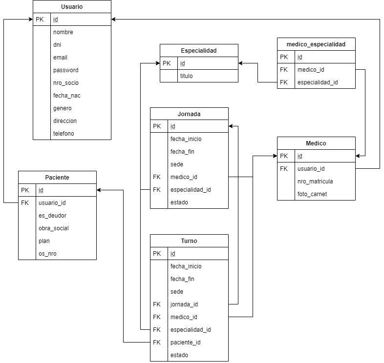

# Centro Médico Arduino

## Back-end application

***

### Base de Datos

Usamos una base de datos SQL con el siguiente formato.

***

### Servicios REST:

URL: `localhost:8000/api`

***

#### Verificar Usuario

`POST` - `/verificarUsuario`

Verifica las credenciales de un usuario para su login en el sistema.

* **Parámetros**

`email`, `password`

* **Devuelve**

Mensaje de éxito: `200 - OK` - `{usuario: Usuario}`

Mensaje de error: `404 - Not found`

***

#### Verificar Cuenta

`POST` - `/verificarCuenta`

Verifica las credenciales de un usuario para su login en el sistema.

* **Parámetros**

`email`, `dni`, `nro_socio`

* **Devuelve**

Mensaje de éxito: `200 - OK`

Mensaje de error: `404 - Not found`

***

#### Cambiar contraseña

`POST` - `/updatePassword`

Permite actualizar la contraseña del usuario en caso de necesitarlo.

* **Parámetros**

`usuario_id`, `password`

* **Devuelve**

Mensaje de éxito: `200 - OK` - `{usuario: Usuario}`

Mensaje de error: `404 - Not found`

***

#### Obtener turnos del paciente

`POST`- `/getTurnosPaciente`

Devuelve la lista de turnos solicitados por un paciente determinado.

* **Parámetros**

`paciente_id`

* **Devuelve**

Mensaje de éxito: `200 - OK` - `{turnos: Turno[]}`

Mensaje de error: `404 - Not found`

***

#### Pedir turno

`POST`- `/pedirTurno`

Genera la conexión entre un turno y un paciente.

* **Parámetros**

`turno_id`,`paciente_id`

* **Devuelve**

Mensaje de éxito: `200 - OK`

Mensaje de error: `404 - Not found`

***

#### Confirmar turno

`POST`- `/confirmarTurno`

Cambia el estado de un turno determinado a "confirmado".

* **Parámetros**

`turno_id`

* **Devuelve**

Mensaje de éxito: `200 - OK`

Mensaje de error: `404 - Not found`

***

#### Cancelar turno

`POST`- `/cancelarTurno`

Cambia el estado de un turno determinado a "cancelado".

* **Parámetros**

`turno_id`

* **Devuelve**

Mensaje de éxito: `200 - OK`

Mensaje de error: `404 - Not found`

***

#### Obtener turnos

`POST`- `/getTurnos`

Devuelve los turnos que estén disponibles según varios filtros: especialidad (requerido), médico y fecha.

* **Parámetros**

`especialidad_id` - `medico_id` - `fecha`

* **Devuelve**

Mensaje de éxito: `200 - OK` - `{turnos: Turno[]}`

Mensaje de error: `404 - Not found`

***

#### Obtener médicos de una Especialidad

`POST`- `/getMedicosEspecialidad`

Devuelve la lista de médicos asignados a una Especialidad determinada.

* **Parámetros**

`título`

* **Devuelve**

Mensaje de éxito: `200 - OK` - `{turnos: Turno[]}`

Mensaje de error: `404 - Not found` - `{message: "Especialidad no encontrada"}`

***

#### Generar Jornada de trabajo de un médico

`POST`- `/generarJornada`

Genera la lista de turnos de una jornada de trabajo de un médico. Recibe el día, el horario de entrada y el horario de salida.

* **Parámetros**

`fecha_inicio`, `fecha_fin`, `sede`, `medico_id`, `especialidad_id`

Las fechas deben ingresarse en el formato: `YYYY-MM-DDThh:mm:00.000Z`

* **Devuelve**

Mensaje de éxito: `201 - Created` - `{turnos: Turno[]}`

Mensaje de error: `400 - Bad Request`

***

#### Generar Jornada de un médico semanalmente

`POST`- `/generarJornada`

Genera la lista de turnos de una lista de jornadas de un médico. Las jornadas se crean cada 7 días, desde la fecha de inicio especificada, por el resto del mes seleccionado.

* **Parámetros**

`fecha_inicio`, `fecha_fin`, `sede`, `medico_id`, `especialidad_id`

Las fechas deben ingresarse en el formato: `YYYY-MM-DDThh:mm:00.000Z`

* **Devuelve**

Mensaje de éxito: `201 - Created` - `{turnos: Turno[]}`

Mensaje de error: `400 - Bad Request`

***

#### Obtener Jornadas de un médico

`POST` - `/getJornadasMedico`

Devuelve la lista de Jornadas de un médico, que contienen los turnos de éste organizados según el día.

* **Parámetros**

`medico_id`

* **Devuelve**

Mensaje de éxito: `200 - OK` - `{jornadas: Jornada[]}`

Mensaje de error: `404 - Not found`

***

